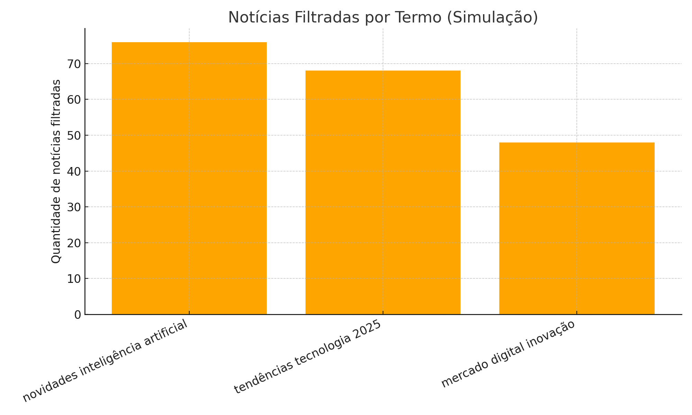
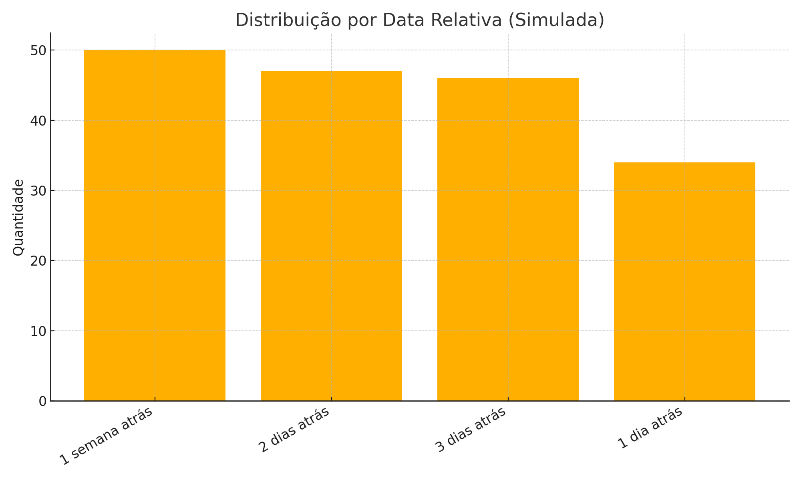

# 📰✨ Web Scraping Premium de Notícias  
Automação inteligente para coleta, filtragem e análise de notícias usando Python.

---

## 🎯 Objetivo Geral

Este projeto realiza a raspagem automatizada de notícias no **Google News**, permitindo buscas avançadas, coleta estruturada, filtragem por relevância e análise visual (simulada) dos resultados.

Ideal para estudos, monitoramento de temas e construção de portfólios profissionais.

---

# 1️⃣ Web Scraping — Como Funciona

## 🔍 Etapas Executadas

✔️ Busca automática no Google News  
✔️ Suporte a múltiplos termos  
✔️ Coleta de título, resumo, link e data relativa  
✔️ Padronização da estrutura dos dados  
✔️ Salvamento dos resultados em CSV  
✔️ Filtragem inteligente por palavras-chave  

 

## 🛠️ Principais Tecnologias

| Tecnologia | Aplicação |
|-----------|-----------|
| **Python** | Linguagem utilizada |
| **Requests** | Acesso ao Google News |
| **BeautifulSoup (bs4)** | Extração de dados HTML |
| **CSV** | Exportação dos resultados |
| **Matplotlib (simulação)** | Geração de gráficos |

---

# 2️⃣ Visualizações (Simuladas)

Para tornar o projeto visual e apresentável em portfólios, foram gerados **gráficos com dados simulados**, respeitando a estrutura real esperada pelo scraping.

---

### 📌 Total de Notícias por Termo  

---

### 📌 Notícias Filtradas por Termo  

---

### 📌 Distribuição por Data Relativa  

---

# 3️⃣ Estrutura Completa do Script

O script realiza:

✔️ Raspagem completa do Google News  
✔️ Tratamento e padronização dos dados coletados  
✔️ Filtragem avançada de conteúdo  
✔️ Exportação dos resultados para CSV  
✔️ Geração de gráficos simulados para documentação e README  

---

# 4️⃣ Arquivos Gerados

- **noticias_coletadas.csv** → todas as notícias extraídas  
- **noticias_filtradas.csv** → notícias que contêm palavras relevantes  
- **/imgs** → imagens utilizadas no README:

---

# ✍️ Autoria  
Cibelly Viegas — 2025  

