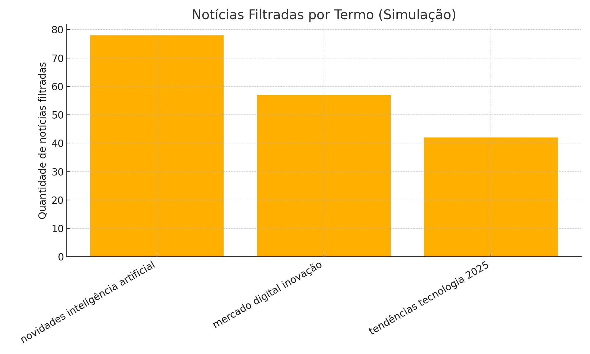

# 📰✨ Web Scraping Premium de Notícias  
Automação inteligente para coleta, filtragem e análise de notícias usando Python.

---

## 🎯 Objetivo Geral

Este projeto realiza a raspagem automatizada de notícias no **Google News**, permitindo buscas avançadas, coleta estruturada, filtragem por relevância e análise visual (simulada) dos resultados.

Ideal para estudos, monitoramento de temas e construção de portfólios profissionais.

---

# 1️⃣ Web Scraping — Como Funciona

## 🔍 Etapas Executadas

✔️ Busca automática no Google News  
✔️ Suporte a múltiplos termos  
✔️ Coleta de título, resumo, link e data relativa  
✔️ Padronização da estrutura dos dados  
✔️ Salvamento dos resultados em CSV  
✔️ Filtragem inteligente por palavras-chave  

 

## 🛠️ Principais Tecnologias

| Tecnologia | Aplicação |
|-----------|-----------|
| **Python** | Linguagem utilizada |
| **Requests** | Acesso à página do Google News |
| **BeautifulSoup (bs4)** | Extração dos dados HTML |
| **CSV** | Exportação dos resultados |
| **Matplotlib (simulação)** | Gráficos de análise |

---

# 2️⃣ Visualizações (Simuladas)

Para tornar o projeto visual e apresentável em portfólios, foram gerados **gráficos com dados simulados**, respeitando a estrutura real dos resultados obtidos pelo script.

Essas imagens podem ser exibidas no README do GitHub ou em apresentações.

---

### 📌 Total de Notícias por Termo  

---

### 📌 Notícias Filtradas por Termo  

---

### 📌 Distribuição por Data Relativa  

---

### 📌 Nuvem de Palavras (Simulada)  

---

# 3️⃣ Estrutura Completa do Script

O código realiza:

✔️ Coleta automatizada  
✔️ Tratamento dos resultados  
✔️ Filtragem por palavras-chave  
✔️ Exportação para CSV  
✔️ Simulação de gráficos para portfólio

---

# 4️⃣ Arquivos Gerados

- `noticias_coletadas.csv` → todas as notícias extraídas  
- `noticias_filtradas.csv` → resultados após aplicar filtros  
- Imagens em `/imgs/` para fins visuais:

